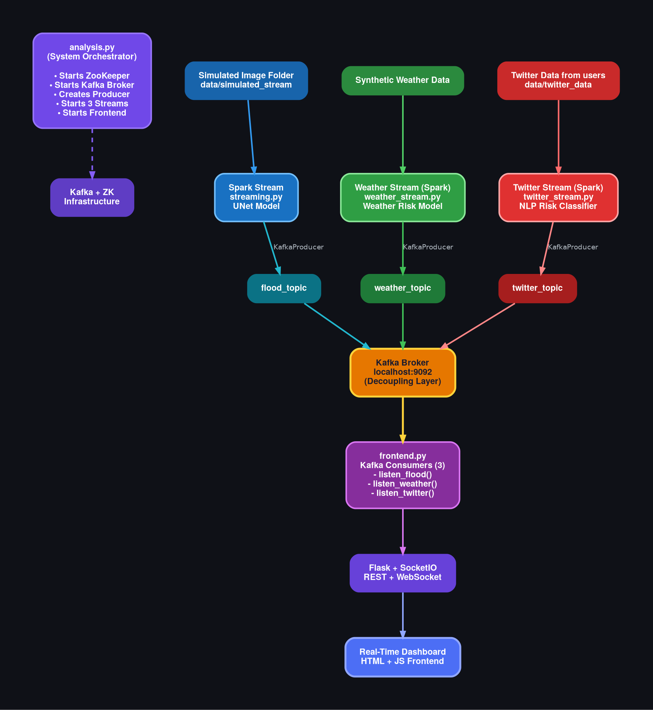

# Real-Time Disaster Prediction System


## 📖 Executive Summary
This project implements a **real-time distributed disaster prediction pipeline** designed to mimic production-grade data engineering architectures used in top-tier technology companies. 

Leveraging **Apache Kafka**, **Spark Structured Streaming**, and **Deep Learning (UNet & BERT)**, the system processes multi-modal data streams—satellite imagery, live weather data, and social media feeds—to generate real-time risk assessments and flood segmentation masks. The results are visualized on a live, low-latency dashboard.

## 🏗 System Architecture
The system is designed with scalability, modularity, and fault tolerance in mind. It uses a decoupled microservices approach where `analysis.py` acts as the primary orchestrator.



### End-to-End Data Flow
1.  **Ingestion:** 
    - Satellite images are streamed via TCP.
    - Twitter and Weather data are fetched via API simulation.
2.  **Processing (Spark Structured Streaming):**
    - **Vision:** A UNet Deep Learning model performs semantic segmentation on flood images.
    - **NLP:** A BERT-based model analyzes sentiment and urgency in social media text.
3.  **Messaging Backbone:**
    - Results are serialized and published to **Apache Kafka** topics (`flood_topic`, `weather_topic`, `twitter_topic`).
4.  **Consumption & Visualization:**
    - A **Flask** backend consumes Kafka messages.
    - Data is pushed to the frontend via **WebSockets (SocketIO)** for real-time updates.

---

## 🛠 Tech Stack

| Component | Technology | Description |
| :--- | :--- | :--- |
| **Orchestration** | Python | System bootstrapping and logic control. |
| **Streaming** | Apache Kafka | Distributed event streaming and message decoupling. |
| **Processing** | Spark Streaming | Real-time distributed data processing. |
| **ML/AI** | PyTorch | UNet for Image Segmentation; Transformers (BERT) for NLP. |
| **Backend** | Flask | REST API and WebSocket server. |
| **Frontend** | HTML/JS | Real-time dashboard using SocketIO. |
| **Coordination** | ZooKeeper | Kafka state management. |

---

## 🚀 Installation & Setup

### 1. Environment Setup
Create a clean Conda environment to manage dependencies.

```bash
conda create -n disaster_detect python=3.10
conda activate disaster_detect
```

Install the required Python packages:

```bash
pip install pandas torch transformers opencv-python numpy pyspark flask flask-socketio kafka-python requests
```

### 2. Directory Structure & Data
**Note:** Large dataset files are excluded from the repository. You must create the directory structure manually.

Run the following command from the project root:

```bash
mkdir -p data/flood_dataset/images
mkdir -p data/flood_dataset/masks
mkdir -p data/simulated_stream
mkdir -p data/twitter_data
```

**Action Required:**
1. Place your flood `.jpg` images in `data/flood_dataset/images/`.
2. Place your corresponding `.png` masks in `data/flood_dataset/masks/`.
3. Ensure filenames match (e.g., `1.jpg` corresponds to `1.png`).


## 🧠 Model Training
Before running the pipeline, you must train the Deep Learning models.

### A. Train Flood Detection (UNet)
This script trains the vision model for 15 epochs and saves the weights.

```bash
cd ml_models/flood_detection
python train.py
```

Output: ml_models/flood_detection/flood_unet_cpu.pth

### B. Train Sentiment Analysis (BERT)
Fine-tune the NLP model using the provided Jupyter Notebook.

```bash
cd twitter
jupyter notebook flood_twitter_data_train.ipynb
```

Run all cells to generate model.safetensors and config files in ml_models/twitter_model/.


## ⚡ How to Run the Pipeline
The system requires **3 separate terminal windows** running concurrently to simulate the distributed environment.

### TERMINAL 1: Image Receiver (TCP Server)
Starts the TCP server on port `5001`. This listens for incoming satellite images.

```bash
cd satellite
python get_stream.py
```
Status: You should see "Waiting for sender..."

### TERMINAL 2: Main Orchestrator
This is the core script. It automatically bootstraps **ZooKeeper**, **Kafka**, **Spark Streams**, and the **Flask Dashboard**.

```bash
cd spark_jobs
python analysis.py
```
**Status:** Kafka and Spark logs will appear. The dashboard will go live at [http://localhost:5000](http://localhost:5000).

### TERMINAL 3: Image Sender (TCP Client)
Once the server (Terminal 1) and Pipeline (Terminal 2) are running, start streaming the data.

```bash
cd satellite
python send_stream.py
```
Action: This reads images from your dataset and streams them every 3 seconds to the processing engine


## 📊 Viewing Results
Open your web browser and navigate to:

**[http://localhost:5000](http://localhost:5000)**

The dashboard displays:
*   **Live Flood Segmentation:** Real-time overlay of flood risk on satellite imagery.
*   **Disaster Analytics:** Aggregated metrics from Twitter sentiment and weather alerts.
*   **System Health:** Latency and processing status.


## 📂 Project Structure

```bash
Disaster_Prediction/
├── data/                        # (Created manually)
│   ├── flood_dataset/           # Training Data
│   └── simulated_stream/        # Live incoming buffer
├── kafka/                       # Kafka binaries & config
├── ml_models/                   # Model artifacts
│   ├── flood_detection/         # UNet training scripts & weights
│   └── twitter_model/           # BERT config & weights
├── satellite/                   # TCP Stream simulation (Client/Server)
├── spark_jobs/                  # Core processing logic
│   ├── analysis.py              # SYSTEM ENTRY POINT
│   ├── streaming.py             # Spark Image Stream
│   ├── twitter_stream.py        # Spark NLP Stream
│   ├── weather_stream.py        # Spark Weather Stream
│   └── frontend/                # Dashboard UI (HTML/CSS/JS)
├── twitter/                     # NLP Training Notebooks
└── README.md
```


## ⚖️ Engineering Impact
This project demonstrates capabilities in:

*   **Distributed Systems Design:** Handling asynchronous data streams via Kafka.
*   **Real-Time Inference:** Deploying PyTorch models within a Spark Streaming context.
*   **Fault Tolerance:** Utilizing Kafka buffering and Spark checkpointing.
*   **Full-Stack Data Engineering:** Managing the flow from raw binary TCP streams to web-socket based visualization.